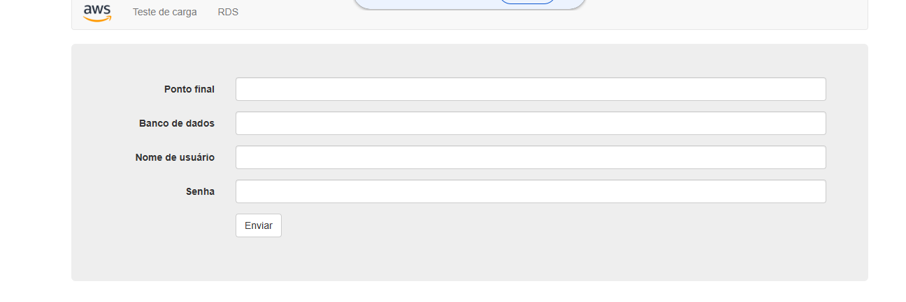

# Construcao-de-uma-Arquitetura-de-Rede-na-AWS

# AWS Network Architecture Lab

## Sobre o Projeto

Este projeto foi desenvolvido durante o programa **AWS re/Start** com o objetivo de construir uma infraestrutura de rede completa na AWS, seguindo requisitos comuns encontrados em ambientes corporativos.

Durante o laboratório foram aplicados conceitos fundamentais de redes em nuvem, segmentação de ambientes, roteamento, segurança e alta disponibilidade, utilizando serviços nativos da Amazon Web Services (AWS).

---

## Arquitetura Implementada

Internet → Internet Gateway → VPC

├── Sub-rede Pública (AZ-A)

│ └── Amazon EC2 Web Server

│

├── NAT Gateway

│

└── Sub-rede Privada (AZ-B)

    └── Recursos Privados

---

## ✅ Atividades Realizadas

### Amazon VPC

* Criação de uma VPC personalizada
* Configuração do bloco CIDR **10.0.0.0/16**

### Sub-redes

* Criação de sub-redes públicas
* Criação de sub-redes privadas
* Distribuição entre diferentes Zonas de Disponibilidade

### Conectividade

* Implementação de Internet Gateway
* Configuração de NAT Gateway
* Associação de tabelas de rotas públicas e privadas

### Segurança

* Configuração de Security Groups
* Aplicação de regras de acesso seguindo boas práticas de segurança

### Computação

* Provisionamento de uma instância Amazon EC2
* Configuração do servidor web
* Testes de conectividade e acesso externo

---

## Resultado Obtido

A infraestrutura foi provisionada com sucesso, permitindo:

* Comunicação entre os componentes da rede.
* Acesso público ao servidor web hospedado na Amazon EC2.
* Acesso seguro à internet para recursos em sub-redes privadas através do NAT Gateway.
* Segmentação adequada da rede utilizando sub-redes públicas e privadas.
* Aplicação de controles de segurança utilizando Security Groups.

---

## Autor

**Viviane Vieira**

🔗 LinkedIn: www.linkedin.com/in/viviane-vieira-de-souza

  

  

  

  

